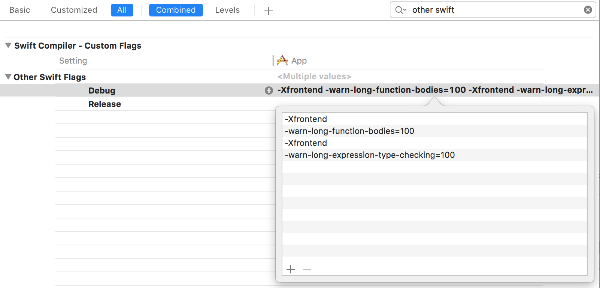
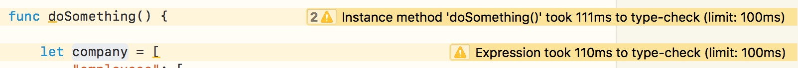
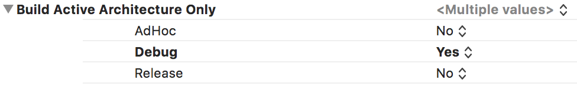
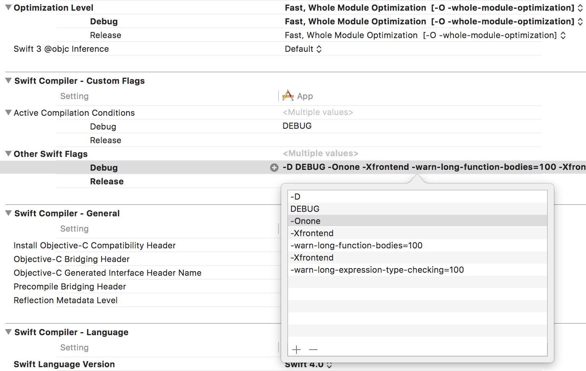
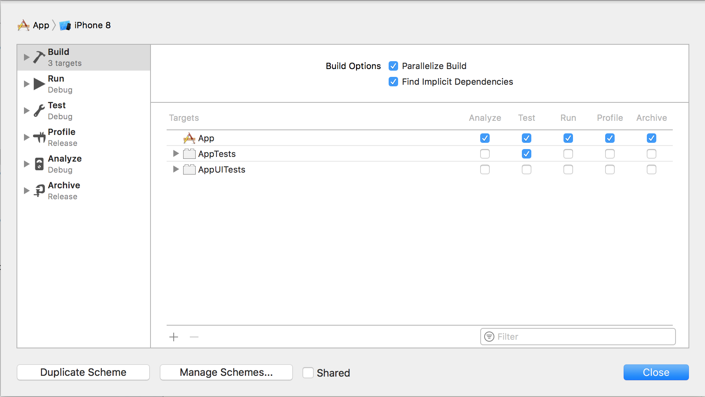
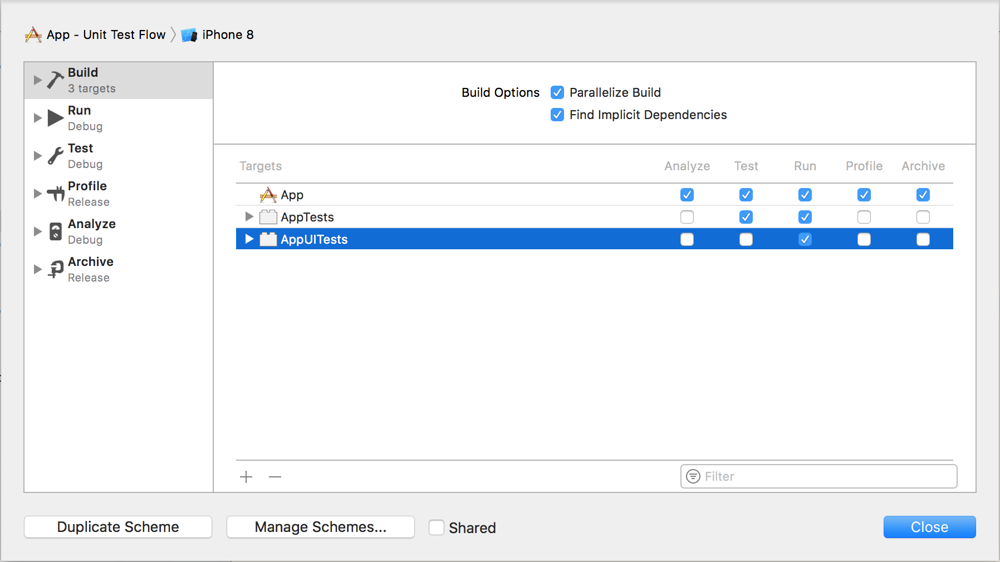
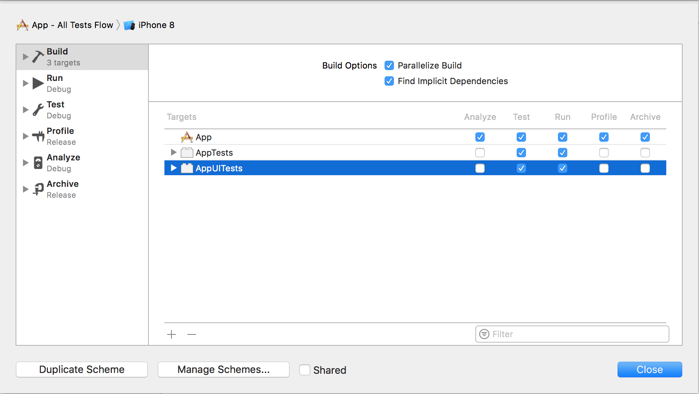

# Optimizing Swift build times

Collection of advice on optimizing compile times of Swift projects.

Swift is constantly improving ❤️. For the time being, though, long compile times persist as a big issue when working on medium-to-large apps. The goal of this project is to gather all there is that can help you shorten your build times.

👷🏻 Maintainer: [Arek Holko](https://twitter.com/arekholko). Anything missing? **Issues and pull requests welcomed!**

# Table of contents

- [Type checking of functions and expressions](#type-checking-of-functions-and-expressions)
- [Slowly compiling files](#slowly-compiling-files)
- [Build active architecture only](#build-active-architecture-only)
- [dSYM generation](#dsym-generation)
- [Whole Module Optimization](#whole-module-optimization)
- [Third-party dependencies](#third-party-dependencies)
- [Modularization](#modularization)
- [XIBs](#xibs)
- [Xcode Schemes](#xcode-schemes)
- [Showing build times in Xcode](#showing-build-times-in-xcode)
- [Use the new Xcode build system](#use-the-new-xcode-build-system)

# Type checking of functions and expressions

Swift build times are slow mostly because of expensive type checking. By default Xcode doesn't show code that's slow to compile. You can instruct it to show slowly compiling functions and expressions, though by adding:

- `-Xfrontend -warn-long-function-bodies=100` (`100` means 100ms here, you should experiment with this value depending on your computer speed and project)
- `-Xfrontend -warn-long-expression-type-checking=100`

to `Other Swift Flags` in build settings:



Build again and you should now see warnings like these:



Next step is to address code that Swift compiler has problems with. [John Sundell](https://www.swiftbysundell.com/posts/improving-swift-compile-times) and [Robert Gummesson](https://medium.com/@RobertGummesson/regarding-swift-build-time-optimizations-fc92cdd91e31) are here to help you with that.

⚠️ Warning: This technique doesn’t work for targets using Whole Module Optimization. Please temporarily disable WMO if you have it enabled.

📖 Sources:

- [Guarding Against Long Compiles](http://khanlou.com/2016/12/guarding-against-long-compiles/)
- [Measuring Swift compile times in Xcode 9 · Jesse Squires](https://www.jessesquires.com/blog/measuring-compile-times-xcode9/)
- [Improving Swift compile times — Swift by Sundell](https://www.swiftbysundell.com/posts/improving-swift-compile-times)
- [Swift build time optimizations — Part 2](https://medium.com/swift-programming/swift-build-time-optimizations-part-2-37b0a7514cbe)

# Slowly compiling files
The previous section described working on an expression- and function-level but it’s often interesting to know compile times of whole files too.

There’s no UI in Xcode for that, though, so you have to build the project from the CLI with correct flags set:

```sh
xcodebuild -destination 'platform=iOS Simulator,name=iPhone 8' \
  -sdk iphonesimulator -project YourProject.xcodeproj \
  -scheme YourScheme -configuration Debug \
  clean build \
  OTHER_SWIFT_FLAGS="-driver-time-compilation \
    -Xfrontend -debug-time-function-bodies \
    -Xfrontend -debug-time-compilation" | \
tee profile.log
```

(Replace `-project YourProject.xcodeproj` with `-workspace YourProject.xcworkspace` if you use a workspace.)

Then extract the interesting statistics using:

```sh
awk '/Driver Compilation Time/,/Total$/ { print }' profile.log | \
  grep compile | \
  cut -c 55- | \
  sed -e 's/^ *//;s/ (.*%)  compile / /;s/ [^ ]*Bridging-Header.h$//' | \
  sed -e "s|$(pwd)/||" | \
  sort -rn | \
  tee slowest.log
```

You’ll end up with `slowest.log` file containing list of all files in the project, along with their compile times. Example:

```
2.7288 (  0.3%)  {compile: Account.o <= Account.swift }
2.7221 (  0.3%)  {compile: MessageTag.o <= MessageTag.swift }
2.7089 (  0.3%)  {compile: EdgeShadowLayer.o <= EdgeShadowLayer.swift }
2.4605 (  0.3%)  {compile: SlideInPresentationAnimator.o <= SlideInPresentationAnimator.swift }
```

⚠️ Warning: This technique doesn’t work for targets using Whole Module Optimization. Please temporarily disable WMO if you have it enabled.

📖 Sources:

- [Diving into Swift compiler performance](https://koke.me/2017/03/24/diving-into-swift-compiler-performance/)

# Build active architecture only

This setting is a default but you should double check that it’s correct. Your project should build only active architecture in Debug configuration.



📖 Sources:

- [What is Build Active Architecture Only](http://samwize.com/2015/01/14/what-is-build-active-architecture-only/)

# dSYM generation

By default in new projects, dSYM files aren’t generated at all for Debug builds. However, it’s sometimes useful to have them available when running on a device – to be able to analyze crashes happening without the debugger attached.

Recommended setup:


📖 Sources:

- [Speeding up Development Build Times With Conditional dSYM Generation](http://holko.pl/2016/10/18/dsym-debug/)

# Whole Module Optimization

Another common trick is to:

- change `Optimization Level` to `Fast, Whole Module Optimization` for Debug configuration
- add `-Onone` flag to `Other Swift Flags` **only for Debug configuration**



What this does is it instructs the compiler to:

> It runs one compiler job with all source files in a module instead of one job per source file  
>   
> Less parallelism but also less duplicated work  
>   
> It's a bug that it's faster; we need to do less duplicated work. Improving this is a goal going forward  

Note that incremental builds with minimal changes seem to be a bit slower under this setup. You should see a vast speedup (2x in many projects) in a worst-case scenario, though.

📖 Sources:

- [Developear - Speeding Up Compile Times of Swift Projects](http://developear.com/blog/2016/12/30/Speed-Swift-Compilation.html)
- [Slava Pestov on Twitter: “@iamkevb It runs one compiler job with all source files in a module instead of one job per source file”](https://twitter.com/slava_pestov/status/911747257103302656)

# Third-party dependencies

There are two ways you can embed third-party dependencies in your projects:

1. as a source that gets compiled each time you perform a clean build of your project (examples: [CocoaPods](https://cocoapods.org), git submodules, copy-pasted code, internal libraries in subprojects that the app target depends on)
2. as a prebuilt framework/library (examples: [Carthage](https://github.com/Carthage/Carthage), static library distributed by a vendor that doesn’t want to provide the source code)

CocoaPods being the most popular [dependency manager](https://twitter.com/arekholko/status/923989580948402177) for iOS by design leads to longer compile times, as the source code of 3rd-party libraries in most cases gets compiled each time you perform a clean build. In general you shouldn’t have to do that often but in reality, you do (e.g. because of switching branches, Xcode bugs, etc.).

Carthage, even though it’s harder to use, is a better choice if you care about build times. You build external dependencies only when you change something in the dependency list (add a new framework, update a framework to a newer version, etc.). That may take 5 or 15 minutes to complete but you do it a lot less often than building code embedded with CocoaPods.

📖 Sources:

- time spent waiting for Xcode to finish builds 😅

# Modularization
Incremental compilation in Swift isn’t perfect. There are projects where changing one string somewhere causes almost a whole project to get recompiled during an incremental build. It’s something that can be debugged and improved but a good tooling for that isn’t available yet.

To avoid issues like that, you should consider splitting your app into modules. In iOS, these are either: dynamic frameworks or static libraries (support for Swift was added in Xcode 9).

Let’s say your app target depends on an internal framework called `DatabaseKit`. The main guarantee of this approach is that when you change something in your app project, `DatabaseKit` **won’t** get recompiled during an incremental build.

📖 Sources:

- [Technical Note TN2435 – Embedding Frameworks In An App](https://developer.apple.com/library/content/technotes/tn2435/_index.html)
- [uFeatures](https://github.com/microfeatures/guidelines)

# XIBs
XIBs/storyboards vs. code. 🔥 It’s as hot a topic as they go but let’s not discuss it fully here. What’s interesting is that when you change the contents of a file in Interface Builder, only that file gets compiled (to NIB format). On the other hand, Swift compiler may decide to recompile a big part of your project when you change e.g. a single line in a public method in a `UIView` subclass.

📖 Sources:

- [(…) in a large project incremental build is much faster if only a .xib was changed (vs. only a line of Swift UI code)](https://twitter.com/MichalCiuba/status/925326831074643968)

# Xcode Schemes
Let’s say we have a common project setup with 3 targets:
- `App`
- `AppTests`
- `AppUITests`

Working with only one scheme is fine but we can do better. The setup we’ve been using recently consists of three schemes:

### App
Builds only the app on cmd-B. Runs only unit tests. Useful for short iterations, e.g. on a UI code, as only the needed code gets built.



### App - Unit Test Flow
Builds both the app and unit test target. Runs only unit tests. Useful when working on code related to unit tests, because you find about compile errors in tests immediately after building a project, not even having to run them!

This scheme is useful when your UI tests take too long to run them often.




### App - All Tests Flow
Builds the app and all test targets. Runs all tests. Useful when working on code close to UI which impacts UI tests.



📖 Sources:

- [All About Schemes](http://pilky.me/17/)

# Showing build times in Xcode
Finally, to be able to actually know whether your build times are improving, you should enable showing them in Xcode’s UI. To do that, run this from the command line:

```
$ defaults write com.apple.dt.Xcode ShowBuildOperationDuration -bool YES
```

Once done, after building a project (cmd-B) you should see:


I recommend comparing build times under same conditions each time, e.g.
1. Quit Xcode.
2. Clear Derived Data (`$ rm -rf ~/Library/Developer/Xcode/DerivedData`).
3. Open your project in Xcode.
4. Start a build either immediately after Xcode opens or after indexing phase completes. The first approach seems to be more representative because starting with Xcode 9 building also performs indexing.

Alternatively, you can time builds from the command line:

```
$ time xcodebuild other params
```

📖 Sources:

- [How to enable build timing in Xcode? - Stack Overflow](https://stackoverflow.com/a/2801156/1990236)

# Use the new Xcode build system
In Xcode 9 Apple [quietly introduced a new build system](https://developer.apple.com/library/content/releasenotes/DeveloperTools/RN-Xcode/Chapters/Introduction.html#//apple_ref/doc/uid/TP40001051-CH1-SW878).  This is a “preview” and is not enabled by default.
It can be significantly faster than the default build system.
To enable it, go to Workspace or Project Settings from the File menu in Xcode. There you can switch build systems to the new build system preview. 

📖 Sources:

- [Faster Swift Builds with the New Xcode Build System](https://github.com/quellish/XcodeNewBuildSystem)
